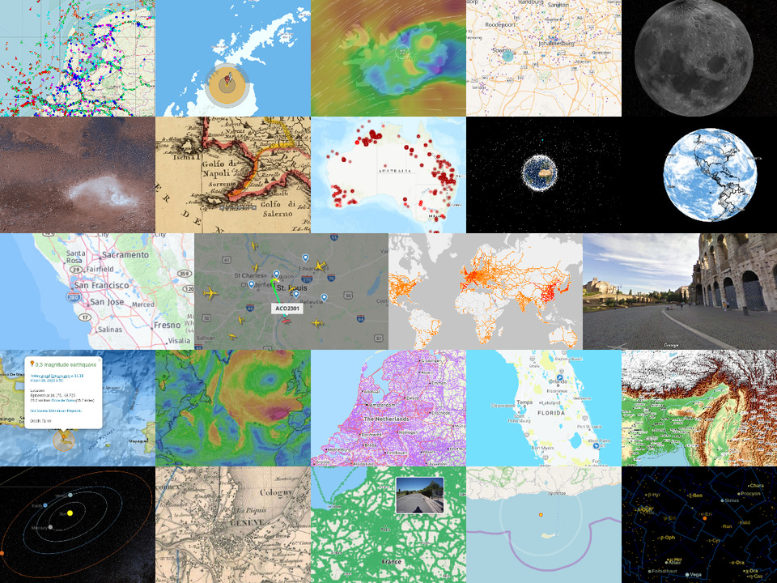

# Awesome Maps

> A curated list of awesome online maps

## Contents

- [Awesome Maps](#awesome-maps)
  - [Contents](#contents)
  - [General Purpose](#general-purpose)
  - [Public Transport](#public-transport)
  - [Street View](#street-view)
  - [Mercator projection](#mercator-projection)
  - [Topography](#topography)
  - [Outdoor](#outdoor)
  - [Accessibility](#accessibility)
  - [Sea](#sea)
  - [Train](#train)
  - [Airspace](#airspace)
  - [Satellites](#satellites)
  - [Sights](#sights)
  - [Accommodation](#accommodation)
  - [Media](#media)
  - [Food](#food)
  - [Weather](#weather)
  - [Catastrophes](#catastrophes)
  - [Historic](#historic)
  - [3D Earth](#3d-earth)
  - [Extraterrestrial](#extraterrestrial)
    - [Nightsky](#nightsky)
    - [Moon](#moon)
    - [Mars](#mars)
    - [Solar System](#solar-system)
    - [Milky Way](#milky-way)
    - [Universe](#universe)
  - [Contribute](#contribute)
  - [License](#license)

## General Purpose

- [Mapcarta](https://mapcarta.com) . Explore open knowledge from OpenStreetMap, Wikipedia, and more.
- [Mapy.cz](https://de.mapy.cz) - General purpose map with various possibilities.
- [HERE WeGo](https://wego.here.com/) - Maps, navigation and routes.
- [OpenStreetMap](https://www.openstreetmap.org/) - The free wiki world map.

## Public Transport

- [OpenRouteService](https://maps.openrouteservice.org/) - Poute planner for directions, isochrones and places.
- [OpenPTMap](http://openptmap.org/) - Public transport lines.
- [Mapnificent](https://www.mapnificent.net/) - Dynamic public transport travel time maps.

## Street View

- [Mapillary](https://www.mapillary.com/app/) - Street-level imagery, powered by collaboration and computer vision.
- [Street View](https://www.google.com/maps/) - 360 degree views of various places.

## Mercator projection

- [The True Size Of](https://thetruesize.com/) - Compare the relative size of countries.

## Topography

- [OpenTopoMap](https://opentopomap.org/) - Free topographic maps.
- [Every Mountain in the World](http://everymountainintheworld.com/) - Find mountains by elevation and prominence.

## Outdoor

- [OpenCycleMap](https://www.opencyclemap.org/) - Global cycling map for overview and planning.
- [Komoot](https://www.komoot.com/plan) - Route planner for hiking, cycling and running.
- [Light pollution map](https://www.lightpollutionmap.info) - Interactive world light pollution map.

## Accessibility

- [Wheelmap](https://wheelmap.org/) - Wwheelchair-accessible places.

## Sea

- [OpenSeaMap](https://map.openseamap.org/) - Free nautical chart.
- [Marine traffic](https://www.marinetraffic.com) - ship location

## Train

- [OpenRailwayMap](https://www.openrailwaymap.org/) - Free map of the world's railway infrastructure.
- [Zugverfolgung.com](https://www.zugverfolgung.com/) - Live train tracking for Germany, Austria, Switzerland Netherlands, and Belgium.
- [Rail Radar](http://raildar.co.uk/radar.html) - Real time movements of trains in the UK.
- [Track Your Train Map](https://www.amtrak.com/track-your-train.html) - Live train tracking in the US.

## Airspace

- [Flightradar24](https://www.flightradar24.com/) - Real time flight tracker map.
- [adsbexchange](https://globe.adsbexchange.com/) - Real time flight tracker map.
- [Sondehub](https://sondehub.org/) - high altitude balloon map

## Satellites

- [ISSTracker](http://www.isstracker.com/) - Real-time location tracking of the international space station.
- [Satellite Map](https://maps.esri.com/rc/sat2/index.html) - Current position and trajectory of 16,000 manmade objects orbiting the earth.
- [Sentinel hub](https://apps.sentinel-hub.com/eo-browser) - LEO Satellite imagery
- [Colorado state website](https://rammb-slider.cira.colostate.edu) - GEO satellite imagery

## Sights

- [OpenTripMap](https://opentripmap.com/) - Map service for sightseeing and travel planning.
- [Wikimapia](https://wikimapia.org/) - Editable map of marked places.
- [AlleBurgen](https://www.alleburgen.de/index-atlas.php) - Castles, palaces and fortified buildings in Europe.

## Accommodation

- [Open Camping Map](https://opencampingmap.org) - World map of camping sites.

## Media

- [Snapchat](https://map.snapchat.com) - recent videos on a map
- [Radio Garden](https://radio.garden) - Listen to radio stations around the world.
- [flickr map](https://www.flickr.com/map) - photos and videos on amap
- [wikishootme](https://wikishootme.toolforge.org/) - Wikipedia images on a map

## Food

- [mundraub](https://mundraub.org/map) - Edible plants and fruits worldwide.
- [McBroken](https://mcbroken.com/) - Is the McDonald's Ice Cream machine broken?

## Weather

- [Windfinder](https://www.windfinder.com/) - Wind forecasts, wind radar, wind force and weather.
- [Windy](https://www.windy.com/) - Wind map, weather forecast and more than 40 other layers.
- [Windguru](https://www.windguru.cz/map/) - Wind and weather model forecast maps.
- [Real Time Lightning Map](https://www.lightningmaps.org/) - Lightning strikes in real time across the planet.
- [OpenWeatherMap](https://openweathermap.org/weathermap) - Interactive weather maps.
- [openSenseMap](https://opensensemap.org/) - Open environmental sensor data all over the world.

## Catastrophes

- [Earthquake Track](https://earthquaketrack.com/) - Map of earthquakes.
- [Forest Watch](https://fires.globalforestwatch.org/map) - Monitoring of forest and land fires.
- [Live Cyber Threat Map](https://threatmap.checkpoint.com/) - Live map of cyber attacks.
- [NUKEMAP](https://nuclearsecrecy.com/nukemap/) - Simulate explosions of nuclear weapons.

## Historic

- [Old Maps Online](https://www.oldmapsonline.org) - Historical maps around the world.
- [Mapire](https://mapire.eu/) - Portal for historical maps.

## 3D Earth

- [Google Earth](https://earth.google.com/web/) - 3D view of the earth in space.
- [Dark Sky Map](https://maps.darksky.net/?3d) - 3D earth with different data layers.

## Extraterrestrial

### Nightsky

- [Stellarium Web](https://stellarium-web.org/) - Virtual online planetarium.

### Moon

- [Moon Trek](https://trek.nasa.gov/moon/) - NASA exploration portal for the moon.

### Mars

- [Mars Trek](https://trek.nasa.gov/mars/) - NASA exploration portal for the mars.

### Solar System

- [3D Solar System Simulator](https://theskylive.com/3dsolarsystem) - Orbits of planets and more than 150 comets and asteroids.
- [Solar System Scope](https://www.solarsystemscope.com/) - Solar system, night sky and outer space in real time.

### Milky Way

- [100,000 Stars](https://stars.chromeexperiments.com/) - Interactive visualization of the stellar neighborhood.

### Universe

- [The Universe in 3D](https://in-the-sky.org/ngc3d.php) - Interactive 3D map of the universe.

## Contribute

Contributions welcome! Read the [contribution guidelines](contributing.md) first.

## License

To the extent possible under law, Simon Siegert has waived all copyright and
related or neighboring rights to this work.
