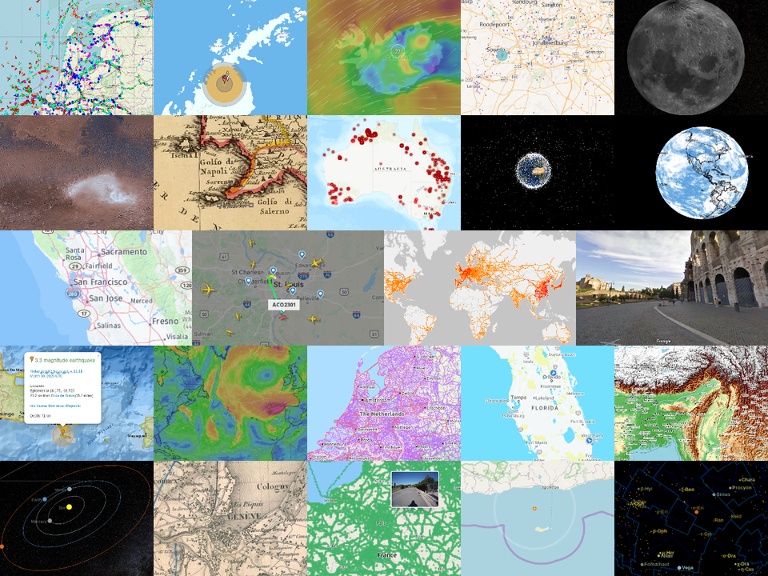

# Awesome Maps

> A curated list of awesome online maps

## Contents

- [Awesome Maps](#awesome-maps)
  - [Contents](#contents)
  - [General Purpose](#general-purpose)
  - [Street View](#street-view)
  - [Topography](#topography)
  - [Cycle](#cycle)
  - [Sea](#sea)
  - [Train](#train)
  - [Airspace](#airspace)
  - [Satellites](#satellites)
  - [Sights](#sights)
  - [Weather](#weather)
  - [Catastrophes](#catastrophes)
  - [Historic](#historic)
  - [3D Earth](#3d-earth)
  - [Extraterrestrial](#extraterrestrial)
    - [Nightsky](#nightsky)
    - [Moon](#moon)
    - [Mars](#mars)
    - [Solar System](#solar-system)
    - [Milky Way](#milky-way)
    - [Universe](#universe)
  - [Contribute](#contribute)
  - [License](#license)

## General Purpose

- [HERE WeGo](https://wego.here.com/) - maps, navigation and routes
- [OpenStreetMap](https://www.openstreetmap.org/) - the free wiki world map

## Street View

- [Mapillary](https://www.mapillary.com/app/) - street-level imagery, powered by collaboration and computer vision
- [Street View](https://www.google.com/maps/) - 360 degree views of various places

## Topography

- [OpenTopoMap](https://opentopomap.org/) - free topographic maps

## Cycle

- [OpenCycleMap](https://www.opencyclemap.org/) - global cycling map for overview and planning

## Sea

- [OpenSeaMap](https://map.openseamap.org/) - free nautical chart

## Train

- [OpenRailwayMap](https://www.openrailwaymap.org/) - free map of the world's railway infrastructure
- [Zugverfolgung.com](https://www.zugverfolgung.com/) - live train tracking for Germany, Austria, Switzerland, Netherlands, and Belgium
- [Rail Radar](http://raildar.co.uk/radar.html) - real time movements of trains in the UK
- [Track Your Train Map](https://www.amtrak.com/track-your-train.html) - live train tracking in the US

## Airspace

- [Flightradar24](https://www.flightradar24.com/) - real time flight tracker map

## Satellites

- [ISSTracker](http://www.isstracker.com/) - real-time location tracking of the international space station
- [Satellite Map](https://maps.esri.com/rc/sat2/index.html) - current position and trajectory of 16,000 manmade objects orbiting the earth

## Sights

- [OpenTripMap](https://opentripmap.com/) - map service for sightseeing and travel planning

## Weather

- [Windfinder](https://www.windfinder.com/) - wind forecasts, wind radar, wind force and weather
- [Windy](https://www.windy.com/) - wind map, weather forecast and more than 40 other layers
- [Real Time Lightning Map](https://www.lightningmaps.org/) - lightning strikes in real time across the planet

## Catastrophes

- [Earthquake Track](https://earthquaketrack.com/) - map of earthquakes
- [Forest Watch](https://fires.globalforestwatch.org/map) - monitoring of forest and land fires
- [Live Cyber Threat Map](https://threatmap.checkpoint.com/) - live map of cyber attacks
- [NUKEMAP](https://nuclearsecrecy.com/nukemap/) - simulate explosions of nuclear weapons

## Historic

- [Old Maps Online](https://www.oldmapsonline.org) - historical maps around the world
- [Mapire](https://mapire.eu/) - portal for historical maps

## 3D Earth

- [Google Earth](https://earth.google.com/web/) - 3D view of the earh in space
- [Dark Sky Map](https://maps.darksky.net/?3d) - 3D earth with different data layers

## Extraterrestrial

### Nightsky

- [Stellarium Web](https://stellarium-web.org/) - virtual online planetarium

### Moon

- [Moon Trek](https://trek.nasa.gov/moon/) - NASA exploration portal for the moon

### Mars

- [Mars Trek](https://trek.nasa.gov/mars/) - NASA exploration portal for the mars

### Solar System

- [3D Solar System Simulator](https://theskylive.com/3dsolarsystem) - orbits of planets and more than 150 comets and asteroids
- [Solar System Scope](https://www.solarsystemscope.com/) - solar system, night sky and outer space in real time

### Milky Way

- [100,000 Stars](https://stars.chromeexperiments.com/) - interactive visualization of the stellar neighborhood

### Universe

- [The Universe in 3D](https://in-the-sky.org/ngc3d.php) - interactive 3D map of the universe

## Contribute

Contributions welcome! Read the [contribution guidelines](contributing.md) first.

## License

To the extent possible under law, Simon Siegert has waived all copyright and
related or neighboring rights to this work.
